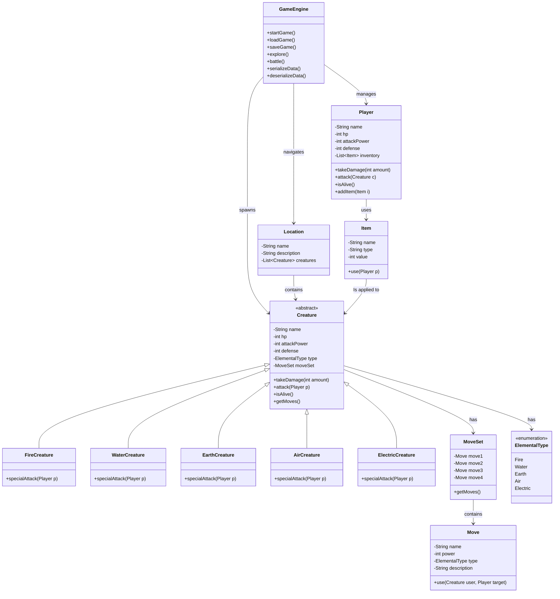

# SlimeBound-Saga
Slime fighter game - Final project for CS 2


```
---Algorithm---

-Start Game
     Display the main menu screen.
    Show the three options, Start Game, Load Game, Quit.
    Read the player's choice.
    If the player chooses Start Game, call newGame().
    If the player chooses Load Game, call loadGame().
    If the player chooses Quit, end the loop and exit the program.
    If the input is invalid,print an error message and repeat the menu.

-New Game-
    Ask the player to enter their name.
    Read the name from the scanner and store it. 
    Create a new player using the name stored.
    Display a welcome message.
    Move the player into the main menu by calling mainMenu().

-Main Menu-
    Show the main menu options, which are, Explore, inventory, Rest, Save Game, and Quit.
    Read the player's choice.
    If explore is selected, call explore().
    If inventory is selected, call inventoryMenu().
    If rest is chosen, call rest().
    If Save Game is chosen, call saveGame().
    If quit is chosen, return to the starting menu.
    If input is invalid, show an error message and loop until a valid choice is inputted.

-Explore-
    Display a message that the player is exploring a forest. (Didn't go too far and kept it to a forest.
    Generate a random wild creature using randomWildCreature().
    Begin the battle with the wild creature by calling battle().

-randomWildCreature-
    Generate a ranom nubmer between 0 and 3.
    If the nubmer is 0, return a normal Slime.
    If the number is 1, return a FireSlime.
    If the number is 2, return a WaterSlime.
    If the number is 3, return an AirSlime.
    If something goes wrong, I've set the basic Slime as a fallback.

-Battle-
    Get the player's active slime.
    Display that a wild creature has appeared. 
    While both creatures have HP remaining:
        Ally Turn:
            Pick a random move from the ally slime.
            Deal damage to the enemy slime.
            Show updated HP bars.
        Player Attack:
            If the enemy is still alive, the player will always perform a random follow-up attack to support thier slime in combat.
            Deal damage to the enemy slime.
        Enemy Turn:
            If the enemy is still alive, it picks a random move from its MoveSet pool.
            Deal damage to the ally slime.
            Show updated HP bars.
    After the loop ends, check who fainted.
    If the enemy fainted, increase the battles won counter and reward items if needed.
    If the ally fainted, display faint message.

-InventoryMenu()
    Display the player's current inventory contents.
    Show options for using a Potion, using a Large Potion, or returning to the previous menu.
    Read the player's choice.
    If potion is chosen, try to heal the active slime for 20 HP.
    If a Large Potion is chosen, try to heal the active slime for 50 HP.
    If the palyer has no Potions, display an error message. 
    Return to the main menu after an action.

-Rest- 
    Get the player's active slime.
    If the slime is fainted, revive it with 10 HP.
    If the slime is alive, heal it by 10 HP.
    Display the respective message depending on the slimes condition. 

-RandomAttack-
    Generate a random number between 0 and the number of attacks the object can perform.
    Baesed on the number, choose one of the object's attacks. Display a message describing the attack. 
    Return the damage value for that attack. 

-Save Game-
    Display a message informing the palyer that the game is saving (Not working currently)
    Open a file called "save.dat" for writing.
    Write the Player object into the file using an ObjectOutputStream.
    Close the file automatically.
    Display a sucesss message (Also kinda didn't get off the ground)

-LoadGame-
    Try to open save.dat for reading.
    Read the Player object from the file.
    Replace the current player with the loaded one.
    Move the player into the main menu.
    Display an error message if saving/loading fails. 

-Use-Case Analysis-
    User: Anyone palying rhe who wants a simple turn-based RPG experience.
    Goal: To "explore" the world and battle wild slimes, manage items, and progress through the small game loop.
    Actions: Choose menu options, fight enemies, heal thier slime, rest, save progress, and load previous saves.
    Outcome: The player experiences a light RPG system with battles, items, and progression through repeated encounters. 

-Compilation Instructions-
    javac *.java
    java GameEngine 

-Makefile-
    javac *.java
    java GameEngine

-How to Play-
    -Start a new game and enter your name. 
    -Explore to battle wild slimes.
    -Use the Inventory to heal your slimes with potions.
    -Use Rest to recover HP.
    -Save your progress at any time. 

-Future Improvments-
    Add damage multipliers depending on type matchup. (Would allow the active slime to be different elements.
    Add a leveling system for the player and slime.
    Add a shop.
    Add multiple save slots (Ambitious) 
```
